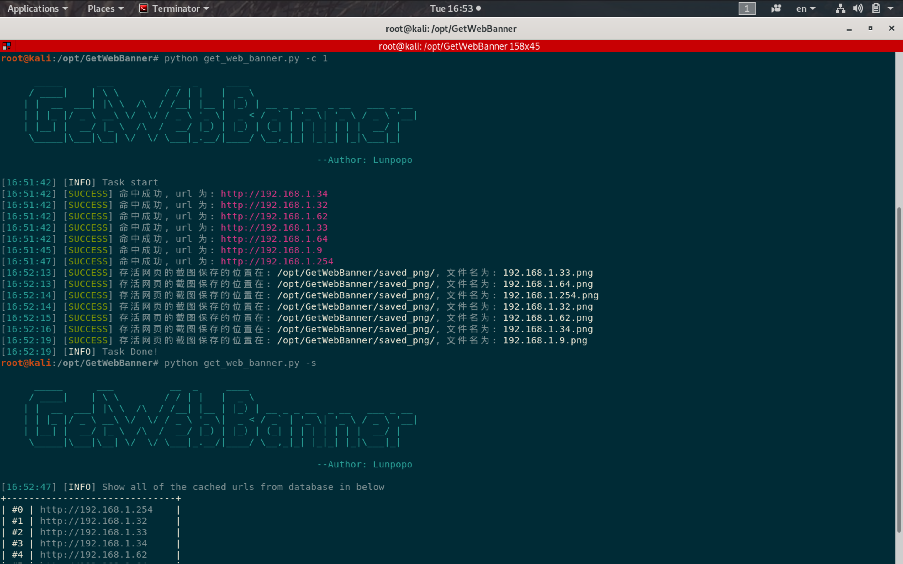
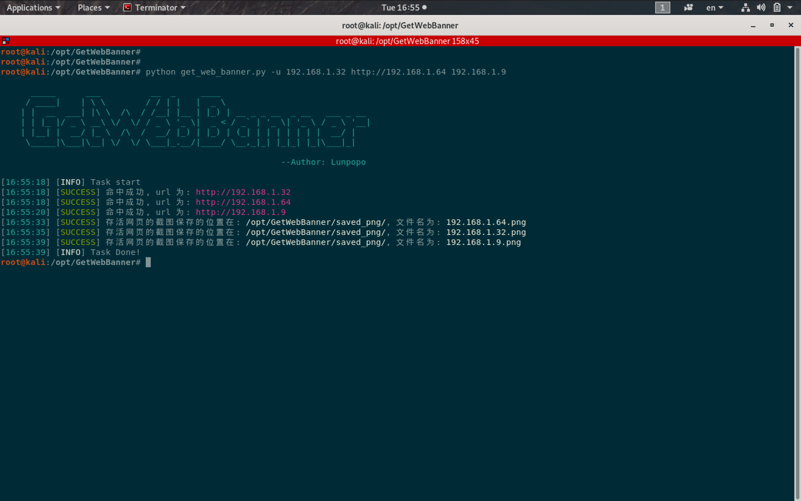
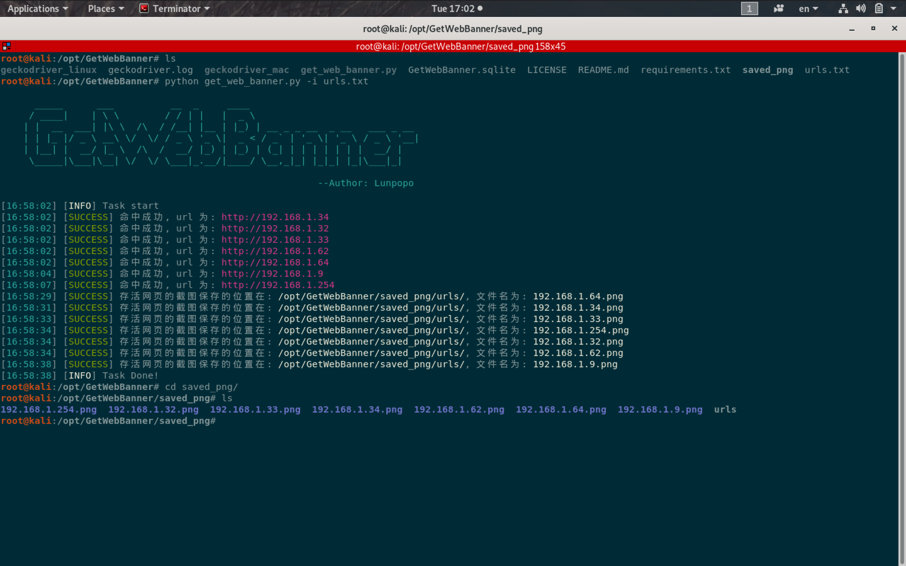

# GetWebBanner
This is GetWebBanner script, a very small and simple tool to take screenshot when scanning target network.

This script aim to find out website who using HTTP server and take screenshot to save.

## Feature
1. It can scan an dozen ip address when you specific -s or --section option from internal network framework.

	for example: python get_web_banner -c 2, input a C section ip 192.168.2.0/24. 
	
	This mean that -c or --section option is 2

2. Support thread to scan target network.
	
	just type -t or --thread option simple

3. Support file input

	scan dozen ip address from file, just simple type -i or --input-file option

4. Database support

	The script can record that has been scanned url in sqlit3 database.

	Just simple type -s or --show-url option and it will show the database data for  you.

5. Cleaning up the cache

	clean the database data, the Geckodriver redundant log file and saved screenshot files.

## Installation
### Python2
```
git clone https://github.com/Lunpopo/GetWebBanner.git
cd GetWebBanner
pip2 install -r requirement.txt
python2 get_web_banner.py -h
```
### Python3
```
git clone https://github.com/Lunpopo/GetWebBanner.git
cd GetWebBanner
pip3 install -r requirement.txt
python3 get_web_banner.py -h
```

## Usage and Argument options
```
usage: get_web_banner.py [-h] [-c INT] [-u TARGET-URL [TARGET-URL ...]]
                         [-i URL-LIST-FILE] [-t INT] [--ssl] [-v] [-s]
                         [--clean]

helper arguments:
  -h, --help            show this help message and exit

Mandatory module:
  arguments that have to be passed for the program to run

  -c INT, --section INT
                        type a C section IP address, eg: 2, This is simple
                        option to point ip address section, for example:
                        192.168.2.0/24. This mean that -c or --section option
                        is 2
  -u TARGET-URL [TARGET-URL ...], --url TARGET-URL [TARGET-URL ...]
                        input target url you want to get screenshot, support
                        input multi urls
  -i URL-LIST-FILE, --input-file URL-LIST-FILE
                        take the file that contain all of urls you want to
                        scan into here, you can get a list of screenshot with
                        those urls

Options module:
  set up parameter to control request

  -t INT, --thread INT  set up threads of number, default is 200 count
  --ssl                 toggle ssl for request
  -v, --verbose         toggle verbose mode

Database module:
  whether turn on verbose mode to output more details info

  -s, --show-urls       show all cached urls in database
  --clean               clean the database cache, the Geckodriver redundant
                        log file and saved screenshot files
```

## Example
* python get_web_banner.py -c 1, this option best use in internal website
	
	

* python get_web_banner.py -u 192.168.1.62, request the url you gave and take screenshot
	
	

* python get_web_banner.py -i urls.txt, request dozen urls you gave and take screenshot
	
	

## Author
[Lunpopo](https://github.com/Lunpopo/get_web_banner)

You can modify and redistribute this script following GNU License and see alse or more details about GNU License to look through LICENSE file in this repository.

If you have good suggestion or good idea to improve this script, wellcome to contact me in Github, Thanks a lot.
